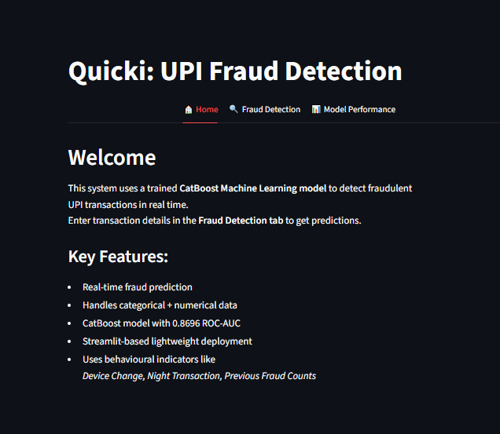
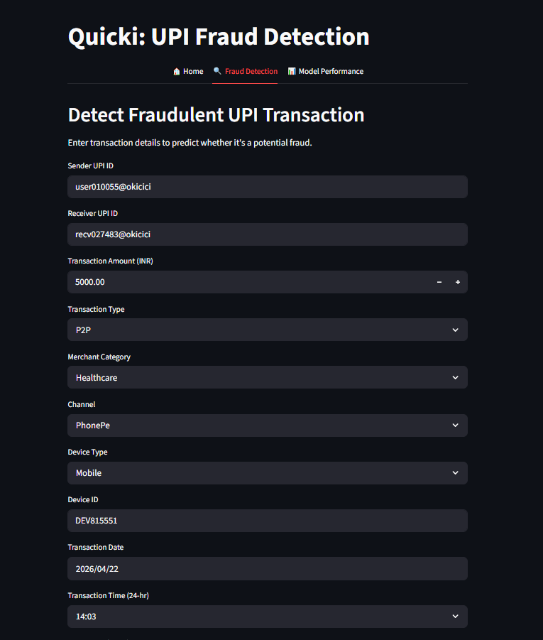
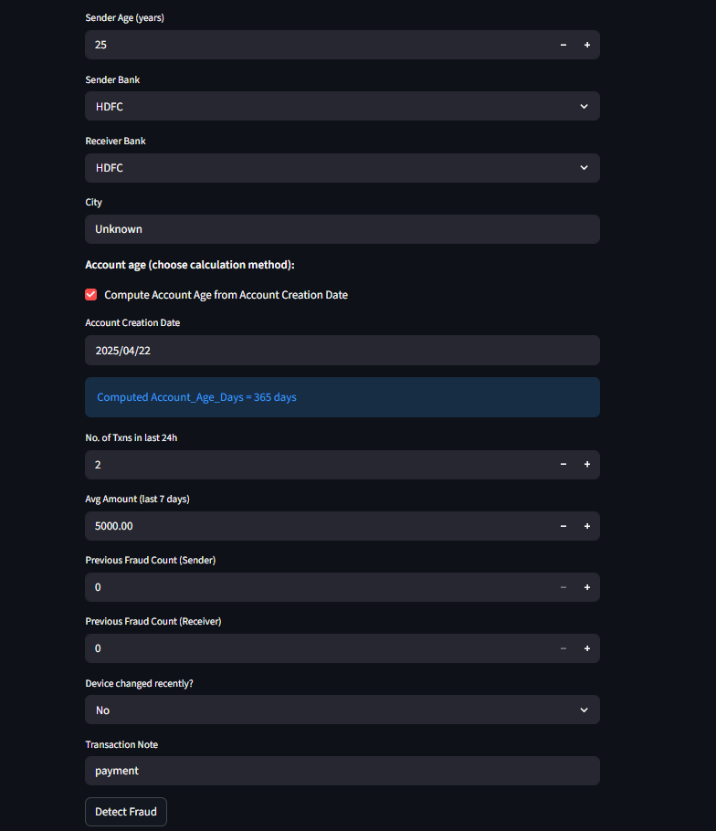
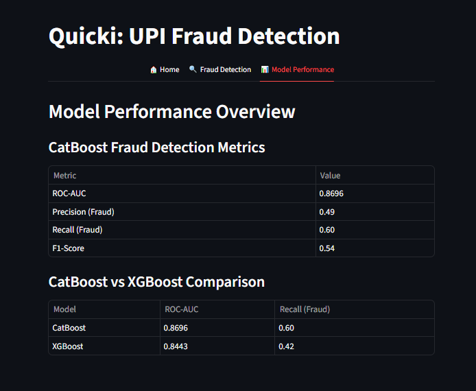

# quicki

# UPI Fraud Detection

A machine learning based fraud detection web app built using Streamlit and CatBoost.

## Features
- Detect suspicious UPI transactions
- Real-time prediction
- Fraud probability score

## Tech Stack
Python, Pandas, CatBoost, Streamlit, Scikit-learn

